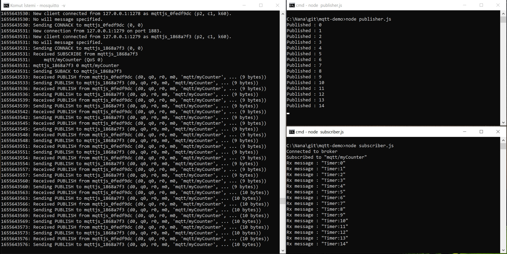

# mqtt-demo on localhost

## Requirements

This site was built using [GitHub Pages](https://pages.github.com/).

- [Node](https://nodejs.org/en/download/)
- [Mosquitto](http://www.steves-internet-guide.com/install-mosquitto-broker/)

1. In command line go to the installation directory of mosquitto eg "C:/Program Files/Mosquitto" and run mosquitto in verbose mode so that you can see console messages.

   **_mosquitto - v_**

2. Go tothe project directory and clone the repository
   **_git clone https://github.com/erkanina/mqtt-demo.git_**

3. Install mqtt package

   **_npm install mqtt_**

4. You will need two console windows, one for publisher and one for subscriber. Run both scripts as below;

   **_Node publisher.js_**

   **_Node subscriber.js_**

   
